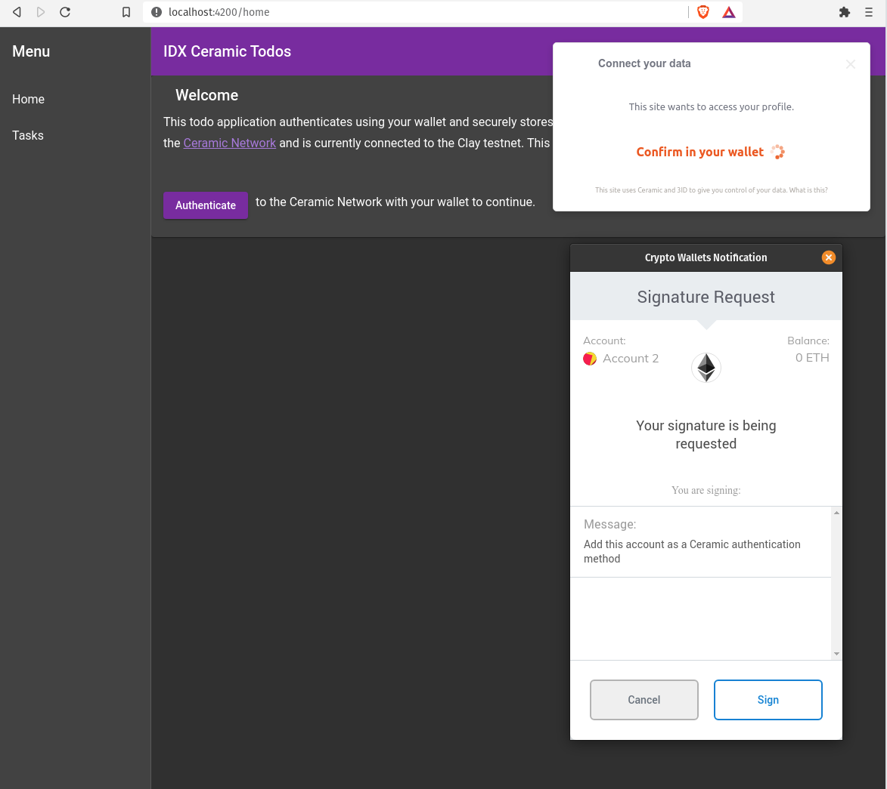

# IDX Ceramic Todos

Submission to ETHDenver 2021 Hackathon

An application that uses a decentralized database on the Ceramic Network to securely store smart documents (todos). It’s a serverless application that ties secure smart documents to a user identity anchored on the Ethereum blockchain.

Special thanks to the IDX and Ceramic developers and to all of EthDenver for a great experience!



## Technologies
- [Ceramic HTTP Client](https://developers.ceramic.network/reference/javascript/clients/#http-client): Provides access to the Ceramic Network via a remote node running Ceramic.
- [3ID Connect](https://developers.ceramic.network/build/authentication/#did-provider-or-wallet): Provides authentication to a DID (used by Ceramic) from a blockchain wallet, and stores a link from this blockchain account to your DID in IDX.
- [IDX](https://idx.xyz/): Provides a way to create identity records for a DID. Records are stored on Ceramic and can represent links to blockchain accounts or other user data.
- [Angular](https://angular.io/): Web application framework.
- [NgRx](https://ngrx.io/): Reactive state management.


## Run Dev Server with Ceramic's Clay Testnet Network
Uses Ceramic's Clay testnet network to store Todo documents. Clone project and run: 
```
cd idx-ceramic-todos
npm i
ng serve
```
Navigate to `http://localhost:4200/`. The app will automatically reload if you change any of the source files.


## Run Dev Server on local Ceramic Network

Clone project and install packages: 
```
cd idx-ceramic-todos
npm i
```

Switch to local Ceramic Network by updating path in `bootstrap.js` and `ceramic-token.ts` to:
```
const CERAMIC_URL = 'http://localhost:7007'
```

Run `npm run ceramic` for the local ceramic server.

Run these commands *only once* to place the schema on the network
```
node -e "console.log(require('crypto').randomBytes(32).toString('hex'))"
SEED=<your seed generated from randomBytes above> npm run bootstrap
```
This creates config.json with globally unique schemas and definition DocIDs and can be shared with other apps.

Finally, run `ng serve` for a dev server. Navigate to `http://localhost:4200/`. The app will automatically reload if you change any of the source files.

## Build

Run `ng build` to build the project. The build artifacts will be stored in the `dist/` directory. Use the `--prod` flag for a production build.


## TODO

- Update task
- Delete task - delete Document and reference
- Mark tasks completed

## References
- Ceramic Documentation: https://developers.ceramic.network/build/writes/
- IDX Documentation: https://developers.idx.xyz/build/writing/
- IDX and Ceramic Sample App: https://github.com/ceramicstudio/eth-denver-2021
- IDX Sample App: https://github.com/ceramicstudio/idx-demo-app and blog post https://blog.ceramic.network/how-to-build-a-simple-notes-app-with-idx/
- Ceramic Web Playground https://ceramicstudio.github.io/web-playground/


